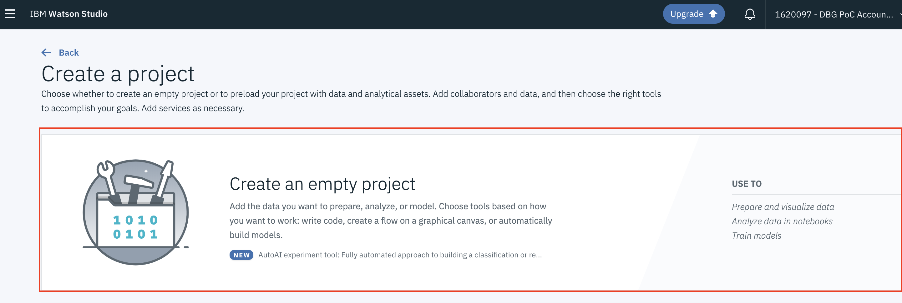
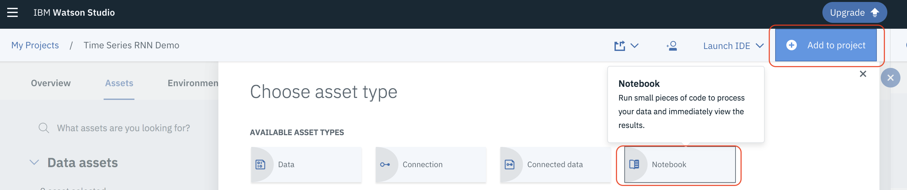
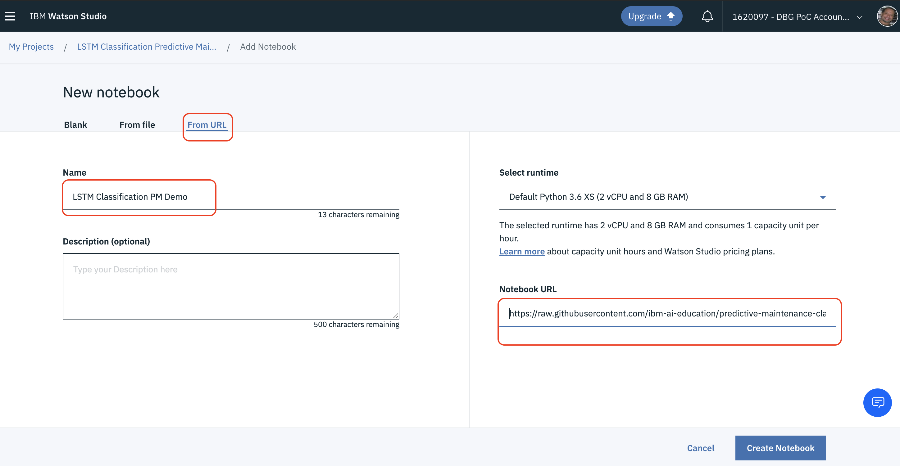
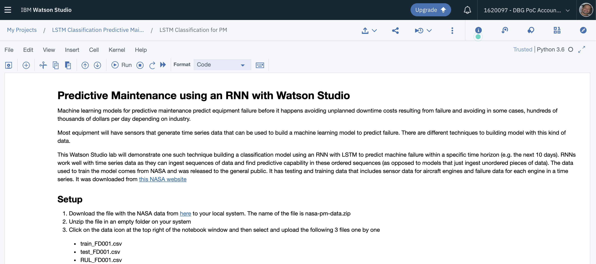

#  Predictive Maintenance using an RNN with Watson Studio

Machine learning models for predictive maintenance predict equipment failure before it happens avoiding unplanned downtime costs resulting from failure and avoiding in some cases  hundreds of thousands of dollars per day depending on industry.

Most equipment will have sensor that generate time series data that can be used to build a machine learning model to predict failure. There are different techniques to building model with this kind of data.

This Watson Studio lab  will demonstrate how to build a classification model using an  RNN with LSTM to predict machine failure within a specific time horizon (e.g. the next 10 days). RNNs work well with time series data as they can ingest sequences of data and find predictive capability in these ordered sequences (as opposed to models that just ingest unordered pieces of data).  The data used to train the model comes from NASA and was released to the general public. It has testing and training data for the maintenance of aircraft engines . It was downloaded from [this NASA website](https://c3.nasa.gov/dashlink/resources/139/)

##  Setup

### 1 Sign up for Watson Studio

If you are not already signed up for Watson Studio, [sign up here](https://www.ibm.com/cloud/watson-studio) else [login here](https://dataplatform.cloud.ibm.com/)

### 2 Create a Watson Studio Project

2.1 From the Watson Studio home page click on **Create a project**

2.2 Select a **Empty** project type and click **Create Project**


2.3 Name the project *LSTM Classification PM*

2.4 if you already have an Object Storage  instance associated with your project, click **Create** and go to Step 3.1

2.5 Else click on **Add** to add an Object Storage instance to your Watson Studio Instance. This will be used to permanently store any data that you upload to Watson Studio

2.6 Accept the defaults, scroll down and click the **Create** button. Click **Confirm**.

2.7 Click **Refresh** to load the details of the new Object Storage instance and then click **Create**


### 3. Create  and run this lab's notebook

3.1 Click on  **Add to project** and then select **Notebook**


3.2 Name the Notebook *LSTM Classification PM Demo* . Select **From URL** and copy the following URL into the **Notebook URL** field and then click **Create Notebook**

```
https://raw.githubusercontent.com/ibm-ai-education/predictive-maintenance-classification-lab/master/nasa-pm-classification.ipynb
```




3.3 After a few seconds the notebook should be loaded


3.4 Follow the instructions in the notebook to complete the exercise.
